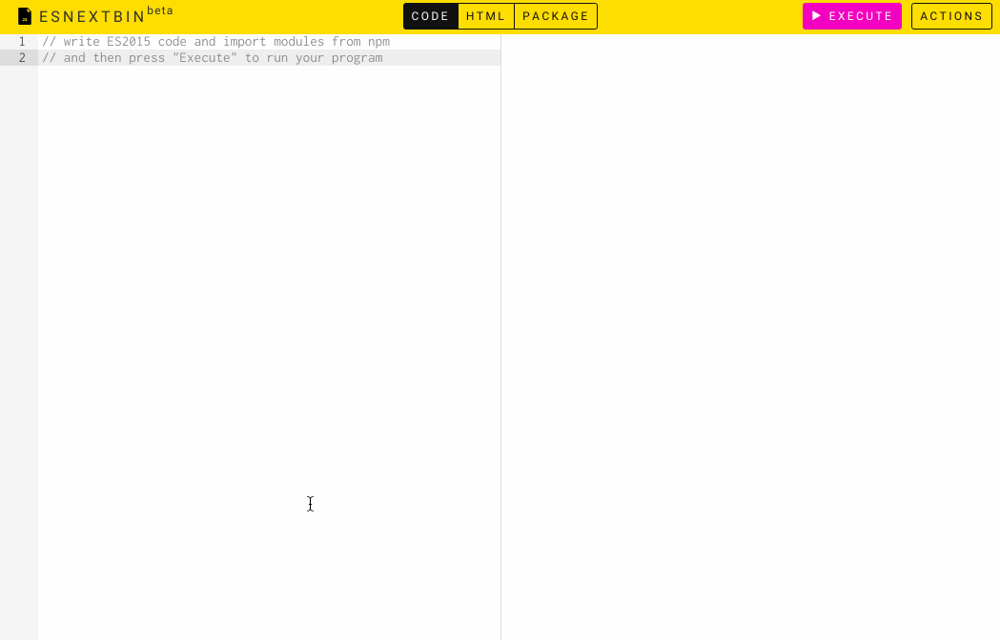

# [esnextb.in](https://esnextb.in)

> Prototype JavaScript apps in the browser with [ES2015](https://babeljs.io/docs/learn-es2015)'s latest features and importing modules directly from [NPM](https://www.npmjs.com).

[](https://esnextb.in)

## How it works?

- The code gets transpiled by latest standalone version of [Babel.js](http://babeljs.io) with `stage-0`, `es2015` and `react` presets enabled
- [Browserify-CDN](https://wzrd.in) is responsible for importing npm modules and browserifying them on the fly
- [Github Gists](https://gist.github.com) are used for saving and sharing code sketches

Under the hood it's pure client-side application which is hosted on [GitHub pages](https://pages.github.com) and is built upon [React.js](https://facebook.github.io/react).

## Usage

Explore latest JavaScript features with the help of several useful npm modules and when you're ready just save the result and share the link with your team mates or community.

### Guide

1. ESNextbin interface consists of 2 main sections - _"Editor"_ on the left side and _"HTML Preview"_ on the right side
2. There are 3 editor tabs - _"Code"_ (for Javascript), _"HTML"_ (for html layout) and _"Package"_ (`package.json` that gets updated automatically when you're executing the code which imports library from npm). Switch editors to manage specific part of your program
3. Write program in _"Code"_ tab and after you are ready hit `▶ Run Code` button to see the result
4. If you have HTML layout or you're manipulating the DOM in your code you'll see the result in _"HTML Preview"_.
5. But all logging, errors and warnings that appear in runtime could be seen ONLY in your browser's console (maybe it's necessary to add "Console" tab?)
6. `Actions` menu provides:
   - saving your code as public and private [gists](https://gist.github.com/) which can be easily shared by copy/pasting link that contains gist id as query param, e.g. `https://esnextb.in?gist=<ID>` (please notice that these actions require GitHub account authorization)
   - _"Enable/Disable Autorun"_ toggles autorunning feature (when it's enabled, the code will be executed after 1s every time when you stop typing without pressing `▶ Run Code` button)
   - _"Clean session"_ resets all editors and unauthorizes your GitHub account (if it was connected)
7. _"Editor"_ section uses [default Ace shortcuts](https://github.com/ajaxorg/ace/wiki/Default-Keyboard-Shortcuts)
8. There are additional shorcuts as well:
   - `Cmd/Ctrl + S` - hotkeys for save your code as public gist action
   - `Cmd/Ctrl + E` - hotkeys for `▶ Run Code` button
   - `Ctrl + Alt + F` - hotkeys for `Run Prettier` button

### Demos

There are several examples for you to play with:

- [React Starter App](https://esnextb.in/?gist=b7e541a42c7c1218cad6)
- [Random Star Wars Names](https://esnextb.in/?gist=27fd38f51a4a9303e9c7)
- [React Soundcloud Player](https://esnextb.in/?gist=a649fc804a722e49fc71)
- [Preact FRP](https://esnextb.in/?gist=ba28702c94e22d26e3bc)
- [Async/await Functions](https://esnextb.in/?gist=f7a6a4cf4c6bf4099fdc)
- [React + Redux](https://esnextb.in/?gist=d6daac6224af08d799bc)
- [Generators](https://esnextb.in/?gist=0f174a29ca6623afe456)
- [D3](https://esnextb.in/?gist=9eac7e72521c21e98817)
- [Vue 2.0 + Vuex](https://esnextb.in/?gist=bd1916ac0c96d75785f8433249967eb2)
- [Pixi.js Basic Example](https://esnextb.in/?gist=f6a3a6197346d4168a5fbbc3ef6b0747)
- [JSX to document.createElement](https://esnextb.in/?gist=f81cbfcb65f3bfbc0d1c5ccc3c748ca5)
- [Reactive view with Proxies and virtual-dom](https://esnextb.in/?gist=8e8b74861f299a672075ae155a86f444)
- [Unidirectional dataflow with Barracks and virtual-dom](https://esnextb.in/?gist=1fbca0bc6537a402e915c0cee53aa4a7)

## Contributing

Please suggest what can be improved, report a bug or ask for a missed features while raising an [issue](https://github.com/voronianski/esnextbin/issues).

## Development

Clone this repo and run these commands inside it:

```bash
npm i
npm run dev
# visit http://localhost:9292/index-dev.html
```

## References

Inspired by awesomeness of [Babel.js REPL](http://babeljs.io/repl) and [Requirebin](http://requirebin.com).

## Support

### Backers

Support project with a monthly donation and help to continue its' development. [Become a backer](https://opencollective.com/esnextbin#backer)

<a href="https://opencollective.com/esnextbin/backer/0/website" target="_blank"></a>

<!-- <a href="https://opencollective.com/esnextbin/backer/1/website" target="_blank"></a>
<a href="https://opencollective.com/esnextbin/backer/2/website" target="_blank"></a>
<a href="https://opencollective.com/esnextbin/backer/3/website" target="_blank"></a>
<a href="https://opencollective.com/esnextbin/backer/4/website" target="_blank"></a>
<a href="https://opencollective.com/esnextbin/backer/5/website" target="_blank"></a>
<a href="https://opencollective.com/esnextbin/backer/6/website" target="_blank"></a>
<a href="https://opencollective.com/esnextbin/backer/7/website" target="_blank"></a>
<a href="https://opencollective.com/esnextbin/backer/8/website" target="_blank"></a>
<a href="https://opencollective.com/esnextbin/backer/9/website" target="_blank"></a>
<a href="https://opencollective.com/esnextbin/backer/10/website" target="_blank"></a>
<a href="https://opencollective.com/esnextbin/backer/11/website" target="_blank"></a>
<a href="https://opencollective.com/esnextbin/backer/12/website" target="_blank"></a>
<a href="https://opencollective.com/esnextbin/backer/13/website" target="_blank"></a>
<a href="https://opencollective.com/esnextbin/backer/14/website" target="_blank"></a>
<a href="https://opencollective.com/esnextbin/backer/15/website" target="_blank"></a>
<a href="https://opencollective.com/esnextbin/backer/16/website" target="_blank"></a>
<a href="https://opencollective.com/esnextbin/backer/17/website" target="_blank"></a>
<a href="https://opencollective.com/esnextbin/backer/18/website" target="_blank"></a>
<a href="https://opencollective.com/esnextbin/backer/19/website" target="_blank"></a>
<a href="https://opencollective.com/esnextbin/backer/20/website" target="_blank"></a>
<a href="https://opencollective.com/esnextbin/backer/21/website" target="_blank"></a>
<a href="https://opencollective.com/esnextbin/backer/22/website" target="_blank"></a>
<a href="https://opencollective.com/esnextbin/backer/23/website" target="_blank"></a>
<a href="https://opencollective.com/esnextbin/backer/24/website" target="_blank"></a>
<a href="https://opencollective.com/esnextbin/backer/25/website" target="_blank"></a>
<a href="https://opencollective.com/esnextbin/backer/26/website" target="_blank"></a>
<a href="https://opencollective.com/esnextbin/backer/27/website" target="_blank"></a>
<a href="https://opencollective.com/esnextbin/backer/28/website" target="_blank"></a>
<a href="https://opencollective.com/esnextbin/backer/29/website" target="_blank"></a>
 -->

### Sponsors

Become a sponsor and get your logo on this README with a link to your site. [Become a sponsor](https://opencollective.com/esnextbin#sponsor)

<a href="https://opencollective.com/esnextbin/sponsor/0/website" target="_blank"></a>

<!-- <a href="https://opencollective.com/esnextbin/sponsor/1/website" target="_blank"></a>
<a href="https://opencollective.com/esnextbin/sponsor/2/website" target="_blank"></a>
<a href="https://opencollective.com/esnextbin/sponsor/3/website" target="_blank"></a>
<a href="https://opencollective.com/esnextbin/sponsor/4/website" target="_blank"></a>
<a href="https://opencollective.com/esnextbin/sponsor/5/website" target="_blank"></a>
<a href="https://opencollective.com/esnextbin/sponsor/6/website" target="_blank"></a>
<a href="https://opencollective.com/esnextbin/sponsor/7/website" target="_blank"></a>
<a href="https://opencollective.com/esnextbin/sponsor/8/website" target="_blank"></a>
<a href="https://opencollective.com/esnextbin/sponsor/9/website" target="_blank"></a>
<a href="https://opencollective.com/esnextbin/sponsor/10/website" target="_blank"></a>
<a href="https://opencollective.com/esnextbin/sponsor/11/website" target="_blank"></a>
<a href="https://opencollective.com/esnextbin/sponsor/12/website" target="_blank"></a>
<a href="https://opencollective.com/esnextbin/sponsor/13/website" target="_blank"></a>
<a href="https://opencollective.com/esnextbin/sponsor/14/website" target="_blank"></a>
<a href="https://opencollective.com/esnextbin/sponsor/15/website" target="_blank"></a>
<a href="https://opencollective.com/esnextbin/sponsor/16/website" target="_blank"></a>
<a href="https://opencollective.com/esnextbin/sponsor/17/website" target="_blank"></a>
<a href="https://opencollective.com/esnextbin/sponsor/18/website" target="_blank"></a>
<a href="https://opencollective.com/esnextbin/sponsor/19/website" target="_blank"></a>
<a href="https://opencollective.com/esnextbin/sponsor/20/website" target="_blank"></a>
<a href="https://opencollective.com/esnextbin/sponsor/21/website" target="_blank"></a>
<a href="https://opencollective.com/esnextbin/sponsor/22/website" target="_blank"></a>
<a href="https://opencollective.com/esnextbin/sponsor/23/website" target="_blank"></a>
<a href="https://opencollective.com/esnextbin/sponsor/24/website" target="_blank"></a>
<a href="https://opencollective.com/esnextbin/sponsor/25/website" target="_blank"></a>
<a href="https://opencollective.com/esnextbin/sponsor/26/website" target="_blank"></a>
<a href="https://opencollective.com/esnextbin/sponsor/27/website" target="_blank"></a>
<a href="https://opencollective.com/esnextbin/sponsor/28/website" target="_blank"></a>
<a href="https://opencollective.com/esnextbin/sponsor/29/website" target="_blank"></a>
 -->

[](https://travis-ci.org/voronianski/esnextbin)
[](https://www.paypal.me/voronianski/5)

---

**MIT Licensed**
